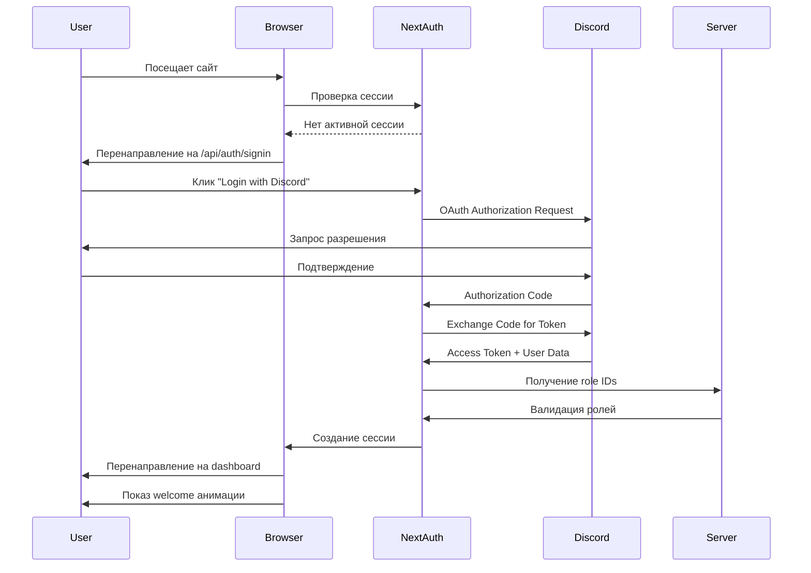
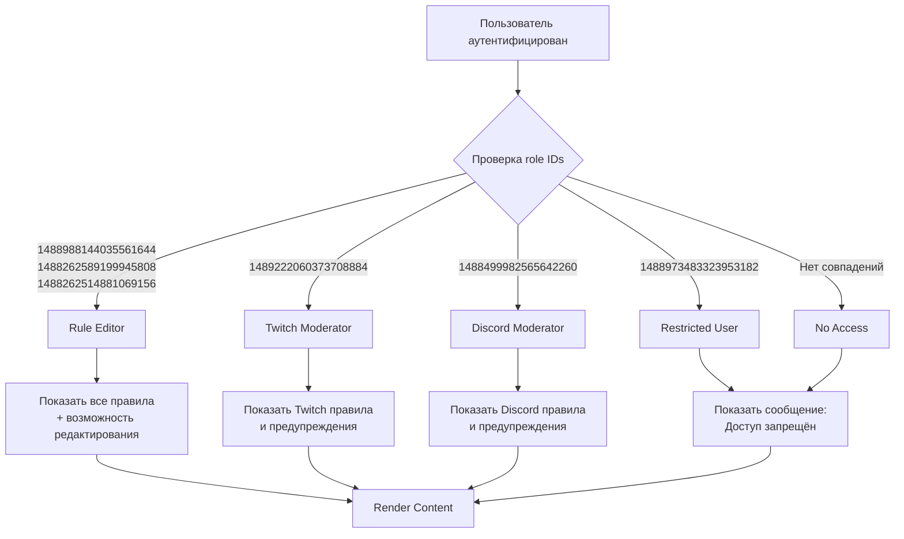

# Design Document: Fear Community Rules Website

## Overview

Fear Community Rules Website представляет собой веб-приложение на основе ролей для отображения правил модерации и предупреждений для персонала фан-сообщества Fear. Система использует Discord OAuth 2.0 для аутентификации и предоставляет различный доступ к контенту на основе Discord role IDs.

### Ключевые характеристики

- **Аутентификация через Discord OAuth 2.0**: Безопасная аутентификация пользователей через их Discord аккаунты
- **Контроль доступа на основе ролей (RBAC)**: Различный контент и возможности для разных Discord ролей
- **Редактирование правил в реальном времени**: Авторизованные пользователи могут редактировать правила непосредственно в интерфейсе
- **Темная фиолетовая тема с glassmorphism**: Современный визуальный дизайн с эффектом матового стекла
- **Плавные анимации**: Высококачественные переходы и эффекты появления
- **Адаптивный дизайн**: Поддержка мобильных устройств, планшетов и десктопов

### Технологический стек

**Frontend:**
- Next.js 14+ (App Router) - React фреймворк с серверным рендерингом
- TypeScript - Типобезопасность
- Tailwind CSS - Утилитарный CSS фреймворк для стилизации
- Framer Motion - Библиотека анимаций
- NextAuth.js - Аутентификация с поддержкой Discord OAuth

**Backend:**
- Next.js API Routes - Серверные эндпоинты
- Node.js File System (fs) - Хранение данных в JSON файлах

**Аутентификация:**
- Discord OAuth 2.0 Provider
- NextAuth.js для управления сессиями

**Хранение данных:**
- JSON файлы на файловой системе сервера
- Структурированное хранение правил и предупреждений

## Architecture

### Архитектурный паттерн

Приложение следует архитектуре **Next.js App Router** с разделением на клиентские и серверные компоненты:

```
┌─────────────────────────────────────────────────────────────┐
│                        Client Browser                        │
│  ┌────────────────────────────────────────────────────────┐ │
│  │           React Components (Client Side)               │ │
│  │  - Profile Display                                     │ │
│  │  - Rule Editor UI                                      │ │
│  │  - Animation Components                                │ │
│  └────────────────┬───────────────────────────────────────┘ │
└───────────────────┼─────────────────────────────────────────┘
                    │ HTTPS
                    │
┌───────────────────▼─────────────────────────────────────────┐
│                    Next.js Server                            │
│  ┌────────────────────────────────────────────────────────┐ │
│  │              Server Components                         │ │
│  │  - Authentication Pages                                │ │
│  │  - Role-based Content Rendering                        │ │
│  └────────────────┬───────────────────────────────────────┘ │
│                   │                                          │
│  ┌────────────────▼───────────────────────────────────────┐ │
│  │              API Routes                                │ │
│  │  - /api/auth/* (NextAuth)                              │ │
│  │  - /api/rules (CRUD operations)                        │ │
│  └────────────────┬───────────────────────────────────────┘ │
│                   │                                          │
│  ┌────────────────▼───────────────────────────────────────┐ │
│  │         Authentication Layer                           │ │
│  │  - NextAuth.js                                         │ │
│  │  - Session Management                                  │ │
│  │  - Role Validation                                     │ │
│  └────────────────┬───────────────────────────────────────┘ │
│                   │                                          │
│  ┌────────────────▼───────────────────────────────────────┐ │
│  │           Data Access Layer                            │ │
│  │  - File System Operations                              │ │
│  │  - JSON Parsing/Serialization                          │ │
│  │  - Backup Management                                   │ │
│  └────────────────┬───────────────────────────────────────┘ │
└───────────────────┼─────────────────────────────────────────┘
                    │
┌───────────────────▼─────────────────────────────────────────┐
│              File System Storage                             │
│  - /data/rules/discord-rules.json                           │
│  - /data/rules/twitch-rules.json                            │
│  - /data/warnings/discord-warnings.json                     │
│  - /data/warnings/twitch-warnings.json                      │
│  - /data/backups/                                           │
└─────────────────────────────────────────────────────────────┘

┌─────────────────────────────────────────────────────────────┐
│                  Discord OAuth Provider                      │
│  - User Authentication                                       │
│  - Role ID Retrieval                                         │
│  - Profile Data (username, avatar)                          │
└─────────────────────────────────────────────────────────────┘
```

### Поток аутентификации



### Поток контроля доступа



## Components and Interfaces

### Компонентная структура


#### 1. Authentication Components

**`AuthProvider`**
- Обертка NextAuth для управления сессиями
- Предоставляет контекст аутентификации всему приложению
- Интерфейс:
```typescript
interface AuthProviderProps {
  children: React.ReactNode;
  session: Session | null;
}
```

**`LoginButton`**
- Кнопка для инициации Discord OAuth flow
- Интерфейс:
```typescript
interface LoginButtonProps {
  className?: string;
  onLoginStart?: () => void;
}
```

**`ProfileDisplay`**
- Отображает Discord username и avatar в правом верхнем углу
- Показывает дополнительную информацию при наведении
- Интерфейс:
```typescript
interface ProfileDisplayProps {
  user: {
    name: string;
    image: string;
    roles: string[];
  };
  onLogout: () => void;
}
```

#### 2. Content Components

**`RuleSection`**
- Отображает секцию правил или предупреждений
- Поддерживает режим просмотра и редактирования
- Интерфейс:
```typescript
interface RuleSectionProps {
  title: string;
  content: RuleContent[];
  editable: boolean;
  onSave?: (content: RuleContent[]) => Promise<void>;
}

interface RuleContent {
  id: string;
  category: string;
  number: string;
  text: string;
  penalty?: string;
  subsections?: RuleContent[];
}
```

**`RuleEditor`**
- Компонент для редактирования отдельного правила
- Inline редактирование с автосохранением
- Интерфейс:
```typescript
interface RuleEditorProps {
  rule: RuleContent;
  onUpdate: (rule: RuleContent) => void;
  onCancel: () => void;
}
```

**`ContentContainer`**
- Контейнер с glassmorphism эффектом
- Обертка для секций контента
- Интерфейс:
```typescript
interface ContentContainerProps {
  children: React.ReactNode;
  className?: string;
  animated?: boolean;
}
```

#### 3. Animation Components

**`WelcomeAnimation`**
- Анимация приветствия после успешной аутентификации
- Использует Framer Motion
- Интерфейс:
```typescript
interface WelcomeAnimationProps {
  userName: string;
  onComplete: () => void;
}
```

**`FadeInText`**
- Компонент для плавного появления текста
- Интерфейс:
```typescript
interface FadeInTextProps {
  children: React.ReactNode;
  delay?: number;
  duration?: number;
}
```

**`AccessDeniedAnimation`**
- Анимированное сообщение об отказе в доступе
- Интерфейс:
```typescript
interface AccessDeniedAnimationProps {
  message: string;
}
```

#### 4. Layout Components

**`MainLayout`**
- Основной layout с header и content area
- Адаптивный дизайн
- Интерфейс:
```typescript
interface MainLayoutProps {
  children: React.ReactNode;
  user?: User;
}
```

**`ResponsiveContainer`**
- Адаптивный контейнер для разных размеров экрана
- Интерфейс:
```typescript
interface ResponsiveContainerProps {
  children: React.ReactNode;
  breakpoint: 'mobile' | 'tablet' | 'desktop';
}
```

### API Endpoints

#### Authentication Endpoints (NextAuth)

**`GET/POST /api/auth/signin`**
- Инициирует Discord OAuth flow
- Response: Redirect to Discord authorization

**`GET /api/auth/callback/discord`**
- Callback endpoint для Discord OAuth
- Обрабатывает authorization code
- Response: Redirect to dashboard with session

**`GET /api/auth/session`**
- Получение текущей сессии пользователя
- Response:
```typescript
{
  user: {
    name: string;
    email: string;
    image: string;
    roles: string[];
  };
  expires: string;
}
```

**`POST /api/auth/signout`**
- Завершение сессии пользователя
- Response: Redirect to login page

#### Rules Management Endpoints

**`GET /api/rules/discord`**
- Получение Discord правил модерации
- Authorization: Требует роль Discord_Moderator или Rule_Editor
- Response:
```typescript
{
  rules: RuleContent[];
  lastModified: string;
}
```

**`GET /api/rules/twitch`**
- Получение Twitch правил модерации
- Authorization: Требует роль Twitch_Moderator или Rule_Editor
- Response:
```typescript
{
  rules: RuleContent[];
  lastModified: string;
}
```

**`PUT /api/rules/discord`**
- Обновление Discord правил
- Authorization: Требует роль Rule_Editor
- Request Body:
```typescript
{
  rules: RuleContent[];
}
```
- Response:
```typescript
{
  success: boolean;
  message: string;
  backup: string; // путь к backup файлу
}
```

**`PUT /api/rules/twitch`**
- Обновление Twitch правил
- Authorization: Требует роль Rule_Editor
- Request Body:
```typescript
{
  rules: RuleContent[];
}
```
- Response:
```typescript
{
  success: boolean;
  message: string;
  backup: string;
}
```

#### Warnings Endpoints

**`GET /api/warnings/discord`**
- Получение Discord предупреждений
- Authorization: Требует роль Discord_Moderator или Rule_Editor
- Response:
```typescript
{
  warnings: WarningContent[];
}
```

**`GET /api/warnings/twitch`**
- Получение Twitch предупреждений
- Authorization: Требует роль Twitch_Moderator или Rule_Editor
- Response:
```typescript
{
  warnings: WarningContent[];
}
```

### Middleware

**`authMiddleware`**
- Проверяет наличие активной сессии
- Валидирует role IDs пользователя
- Защищает API routes и страницы
- Интерфейс:
```typescript
interface AuthMiddlewareConfig {
  requiredRoles?: string[];
  redirectTo?: string;
}
```

**`roleMiddleware`**
- Проверяет наличие необходимых ролей для доступа
- Возвращает 403 при отсутствии прав
- Интерфейс:
```typescript
interface RoleMiddlewareConfig {
  allowedRoles: string[];
  errorMessage?: string;
}
```

## Data Models

### User Model

```typescript
interface User {
  id: string;                    // Discord user ID
  name: string;                  // Discord username
  email: string;                 // Discord email
  image: string;                 // Discord avatar URL
  roles: string[];               // Array of Discord role IDs
  accessLevel: AccessLevel;      // Computed access level
  createdAt: Date;
  lastLogin: Date;
}

enum AccessLevel {
  RULE_EDITOR = 'rule_editor',
  DISCORD_MODERATOR = 'discord_moderator',
  TWITCH_MODERATOR = 'twitch_moderator',
  RESTRICTED = 'restricted',
  NO_ACCESS = 'no_access'
}
```

### Rule Content Model

```typescript
interface RuleContent {
  id: string;                    // Unique identifier
  category: string;              // Категория правила (например, "Основы")
  number: string;                // Номер правила (например, "1.1")
  text: string;                  // Текст правила
  penalty?: string;              // Наказание (например, "Выговор -> Снятие -> Бан")
  subsections?: RuleContent[];   // Подразделы
  metadata: {
    createdAt: Date;
    updatedAt: Date;
    updatedBy: string;           // User ID who last updated
  };
}
```

### Warning Content Model

```typescript
interface WarningContent {
  id: string;
  title: string;
  description: string;
  severity: 'low' | 'medium' | 'high' | 'critical';
  metadata: {
    createdAt: Date;
    updatedAt: Date;
  };
}
```

### Session Model

```typescript
interface Session {
  user: User;
  expires: string;               // ISO 8601 timestamp
  accessToken: string;           // Discord access token
  refreshToken?: string;         // Discord refresh token
}
```

### Storage Models

**Discord Rules Storage (`discord-rules.json`)**
```typescript
interface DiscordRulesStorage {
  version: string;
  lastModified: string;
  rules: {
    основы: RuleContent[];
    обязанности: RuleContent[];
    субординация: RuleContent[];
    безопасность: RuleContent[];
    конфиденциальность: RuleContent[];
    действия: RuleContent[];
    конфликты: RuleContent[];
    активность: RuleContent[];
    ограничение: RuleContent[];
  };
}
```

**Twitch Rules Storage (`twitch-rules.json`)**
```typescript
interface TwitchRulesStorage {
  version: string;
  lastModified: string;
  rules: {
    punishmentScale: RuleContent[];
    timeoutCommands: RuleContent[];
    banCommands: RuleContent[];
    prohibitedActions: RuleContent[];
    interactionGuidelines: RuleContent[];
    technicalCommands: RuleContent[];
    emergencyProcedures: RuleContent[];
  };
}
```

### Role Configuration

```typescript
interface RoleConfig {
  RULE_EDITORS: string[];        // [1488988144035561644, 1488262589199945808, 1488262514881069156]
  DISCORD_MODERATOR: string;     // 1488499982565642260
  TWITCH_MODERATOR: string;      // 1489222060373708884
  RESTRICTED_USER: string;       // 1488973483323953182
}

const ROLE_HIERARCHY = {
  RULE_EDITOR: 4,
  DISCORD_MODERATOR: 3,
  TWITCH_MODERATOR: 3,
  RESTRICTED: 1,
  NO_ACCESS: 0
};
```


## Correctness Properties

*A property is a characteristic or behavior that should hold true across all valid executions of a system—essentially, a formal statement about what the system should do. Properties serve as the bridge between human-readable specifications and machine-verifiable correctness guarantees.*

Данный проект включает значительную UI функциональность, интеграции с внешними сервисами и простые CRUD операции. Однако существует критическая бизнес-логика, которая подходит для property-based testing:

- Логика контроля доступа на основе ролей
- Сериализация/десериализация данных правил
- Валидация role IDs
- Управление backup'ами

### Property 1: Role ID Extraction from Discord Response

*For any* valid Discord OAuth response containing user data, the system SHALL correctly extract all role IDs from the response structure, regardless of the number of roles or their order.

**Validates: Requirements 1.2**

**Rationale:** Discord может возвращать различные структуры данных с разным количеством ролей. Система должна корректно извлекать role IDs независимо от формата ответа.

**Test Strategy:** Генерировать случайные Discord OAuth ответы с различным количеством ролей (0, 1, множество), различным порядком, различными форматами (массивы, объекты) и проверять, что все role IDs корректно извлечены.

### Property 2: Highest Access Level Selection

*For any* combination of valid Discord role IDs, when a user has multiple qualifying roles, the system SHALL always grant the access level with the highest priority according to the role hierarchy (RULE_EDITOR > DISCORD_MODERATOR = TWITCH_MODERATOR > RESTRICTED > NO_ACCESS).

**Validates: Requirements 2.5**

**Rationale:** Пользователи могут иметь несколько ролей одновременно. Система должна детерминированно выбирать наивысший уровень доступа согласно определенной иерархии.

**Test Strategy:** Генерировать случайные комбинации role IDs (включая пустые массивы, одиночные роли, множественные роли, смешанные валидные и невалидные роли) и проверять, что возвращаемый AccessLevel соответствует наивысшему приоритету в иерархии.

### Property 3: Rule Content Serialization Round-Trip with Structure Preservation

*For any* valid RuleContent object (including nested subsections, metadata, and formatting), serializing to JSON and then deserializing SHALL produce an equivalent object with identical structure, content, and formatting.

**Validates: Requirements 3.2, 3.4, 10.1, 10.3**

**Rationale:** Правила модерации содержат сложную иерархическую структуру с вложенными подразделами. Сериализация и десериализация должны сохранять все данные, структуру и форматирование без потерь.

**Test Strategy:** Генерировать случайные RuleContent объекты с различной глубиной вложенности (0-5 уровней), различным количеством subsections, различными типами данных в полях (строки с unicode, специальные символы, пустые строки), различными metadata. Сериализовать в JSON, десериализовать и проверять глубокое равенство объектов.

### Property 4: Backup Creation Before Updates

*For any* update operation on RuleContent, the system SHALL create a backup file containing the previous version of the data before applying the update, and the backup SHALL be a valid, loadable copy of the original data.

**Validates: Requirements 10.4**

**Rationale:** Перед любым обновлением правил необходимо создавать backup для возможности восстановления. Backup должен быть валидным и загружаемым.

**Test Strategy:** Генерировать случайные RuleContent объекты, выполнять операции обновления, проверять, что backup файл создан, содержит предыдущую версию данных и может быть успешно десериализован обратно в RuleContent объект.

### Property 5: Role ID Validation Against Configuration

*For any* array of Discord role IDs, the validation function SHALL correctly identify which role IDs match the configured roles (RULE_EDITORS, DISCORD_MODERATOR, TWITCH_MODERATOR, RESTRICTED_USER) and which do not, regardless of array size or order.

**Validates: Requirements 11.5**

**Rationale:** Система должна корректно валидировать role IDs пользователя против сконфигурированного списка ролей, независимо от количества и порядка ролей.

**Test Strategy:** Генерировать случайные массивы role IDs (пустые, содержащие только валидные роли, только невалидные, смешанные, дубликаты, различный порядок) и проверять, что валидация корректно классифицирует каждый role ID как валидный или невалидный согласно конфигурации.

## Error Handling

### Authentication Errors

**Discord OAuth Failures**
- **Scenario**: Discord OAuth provider недоступен или возвращает ошибку
- **Handling**: 
  - Отображение user-friendly сообщения об ошибке
  - Логирование детальной информации об ошибке
  - Предложение повторить попытку
  - Fallback на страницу ошибки с контактной информацией

**Invalid Token**
- **Scenario**: Access token истек или невалиден
- **Handling**:
  - Автоматическая попытка refresh token (если доступен)
  - При неудаче - редирект на login страницу
  - Очистка невалидной сессии

**Role Extraction Failure**
- **Scenario**: Невозможно извлечь role IDs из Discord ответа
- **Handling**:
  - Логирование структуры ответа для debugging
  - Присвоение NO_ACCESS уровня доступа
  - Отображение сообщения о необходимости контакта с администратором

### Data Persistence Errors

**File System Errors**
- **Scenario**: Ошибка чтения/записи файла (permissions, disk full, file locked)
- **Handling**:
  - Отображение error message пользователю
  - Логирование детальной ошибки
  - Сохранение изменений в temporary location
  - Уведомление администратора через logging system

**JSON Parsing Errors**
- **Scenario**: Поврежденный JSON файл
- **Handling**:
  - Попытка загрузки из последнего backup
  - Если backup недоступен - использование default rules
  - Логирование ошибки и уведомление администратора
  - Отображение warning пользователю о загрузке default данных

**Backup Creation Failure**
- **Scenario**: Невозможно создать backup перед обновлением
- **Handling**:
  - Блокировка операции обновления
  - Отображение error message
  - Логирование причины ошибки
  - Не применять изменения без успешного backup

### Concurrent Edit Conflicts

**Simultaneous Edits**
- **Scenario**: Два Rule_Editor'а редактируют одно правило одновременно
- **Handling**:
  - Использование optimistic locking с version/timestamp
  - При конфликте - отображение conflict resolution UI
  - Показ обеих версий изменений
  - Возможность выбора версии или merge вручную

**Stale Data**
- **Scenario**: Пользователь редактирует устаревшую версию данных
- **Handling**:
  - Проверка timestamp перед сохранением
  - Отклонение сохранения с уведомлением
  - Предложение reload актуальных данных
  - Сохранение изменений пользователя в draft для предотвращения потери

### Validation Errors

**Invalid Rule Content**
- **Scenario**: RuleContent не соответствует ожидаемой структуре
- **Handling**:
  - Валидация на клиенте перед отправкой
  - Валидация на сервере перед сохранением
  - Отображение конкретных ошибок валидации
  - Блокировка сохранения до исправления

**Missing Required Fields**
- **Scenario**: Отсутствуют обязательные поля (id, category, text)
- **Handling**:
  - Highlight полей с ошибками
  - Отображение списка missing fields
  - Блокировка сохранения

### Network Errors

**API Request Failures**
- **Scenario**: Сетевая ошибка при запросе к API
- **Handling**:
  - Автоматический retry с exponential backoff (3 попытки)
  - Отображение loading indicator
  - При неудаче - error message с возможностью manual retry
  - Сохранение изменений локально для последующей синхронизации

**Timeout**
- **Scenario**: Запрос превышает timeout (30 секунд)
- **Handling**:
  - Отмена запроса
  - Отображение timeout message
  - Предложение повторить попытку
  - Логирование для мониторинга performance

### Error Logging and Monitoring

**Logging Strategy**
- Client-side errors: Console logging + optional error reporting service
- Server-side errors: Structured logging с уровнями (ERROR, WARN, INFO)
- Critical errors: Immediate notification администратора

**Error Information**
- Timestamp
- User ID (если доступен)
- Error type и message
- Stack trace
- Request context (URL, method, payload)
- Browser/environment information


## Testing Strategy

### Overview

Стратегия тестирования использует комбинацию различных типов тестов для обеспечения комплексного покрытия:

1. **Property-Based Tests**: Для критической бизнес-логики (контроль доступа, сериализация данных)
2. **Unit Tests**: Для конкретных примеров, edge cases и компонентов
3. **Integration Tests**: Для взаимодействия с внешними сервисами и файловой системой
4. **UI Component Tests**: Для React компонентов и визуальных элементов
5. **End-to-End Tests**: Для критических user flows

### Property-Based Testing

**Framework**: [fast-check](https://github.com/dubzzz/fast-check) для JavaScript/TypeScript

**Configuration**:
- Minimum 100 iterations per property test
- Seed для воспроизводимости failures
- Shrinking для минимизации failing examples

**Property Tests Implementation**:

#### Property 1: Role ID Extraction
```typescript
// Feature: fear-community-rules-website, Property 1: Role ID Extraction from Discord Response
describe('Property: Role ID Extraction', () => {
  it('should extract all role IDs from any valid Discord response', () => {
    fc.assert(
      fc.property(
        fc.array(fc.string()), // Generate random array of role IDs
        (roleIds) => {
          const discordResponse = createMockDiscordResponse(roleIds);
          const extracted = extractRoleIds(discordResponse);
          return arraysEqual(extracted.sort(), roleIds.sort());
        }
      ),
      { numRuns: 100 }
    );
  });
});
```

#### Property 2: Highest Access Level Selection
```typescript
// Feature: fear-community-rules-website, Property 2: Highest Access Level Selection
describe('Property: Highest Access Level', () => {
  it('should always return the highest access level for any role combination', () => {
    fc.assert(
      fc.property(
        fc.array(fc.oneof(
          fc.constant(ROLE_CONFIG.RULE_EDITORS[0]),
          fc.constant(ROLE_CONFIG.DISCORD_MODERATOR),
          fc.constant(ROLE_CONFIG.TWITCH_MODERATOR),
          fc.constant(ROLE_CONFIG.RESTRICTED_USER),
          fc.string() // Random invalid role
        )),
        (roleIds) => {
          const accessLevel = determineAccessLevel(roleIds);
          const expectedLevel = calculateExpectedHighestLevel(roleIds);
          return accessLevel === expectedLevel;
        }
      ),
      { numRuns: 100 }
    );
  });
});
```

#### Property 3: Rule Content Serialization Round-Trip
```typescript
// Feature: fear-community-rules-website, Property 3: Rule Content Serialization Round-Trip with Structure Preservation
describe('Property: Rule Content Round-Trip', () => {
  it('should preserve structure and content through serialization', () => {
    fc.assert(
      fc.property(
        generateRuleContentArbitrary(), // Custom generator for RuleContent
        (ruleContent) => {
          const serialized = JSON.stringify(ruleContent);
          const deserialized = JSON.parse(serialized);
          return deepEqual(ruleContent, deserialized);
        }
      ),
      { numRuns: 100 }
    );
  });
});
```

#### Property 4: Backup Creation
```typescript
// Feature: fear-community-rules-website, Property 4: Backup Creation Before Updates
describe('Property: Backup Creation', () => {
  it('should create valid backup before any update', () => {
    fc.assert(
      fc.property(
        generateRuleContentArbitrary(),
        generateRuleContentArbitrary(),
        async (originalContent, updatedContent) => {
          await saveRuleContent(originalContent);
          const backupPath = await updateRuleContent(updatedContent);
          const backupContent = await loadBackup(backupPath);
          return deepEqual(originalContent, backupContent);
        }
      ),
      { numRuns: 100 }
    );
  });
});
```

#### Property 5: Role ID Validation
```typescript
// Feature: fear-community-rules-website, Property 5: Role ID Validation Against Configuration
describe('Property: Role ID Validation', () => {
  it('should correctly validate any array of role IDs', () => {
    fc.assert(
      fc.property(
        fc.array(fc.string()),
        (roleIds) => {
          const validationResult = validateRoleIds(roleIds);
          const expectedValid = roleIds.filter(id => isConfiguredRole(id));
          const expectedInvalid = roleIds.filter(id => !isConfiguredRole(id));
          return (
            arraysEqual(validationResult.valid.sort(), expectedValid.sort()) &&
            arraysEqual(validationResult.invalid.sort(), expectedInvalid.sort())
          );
        }
      ),
      { numRuns: 100 }
    );
  });
});
```

### Unit Testing

**Framework**: Jest + React Testing Library

**Coverage Areas**:

#### Authentication Logic
- Конкретные примеры успешной аутентификации
- Logout flow
- Session management
- Token refresh

#### Role-Based Access Control
- Конкретные примеры для каждой роли:
  - Twitch_Moderator видит Twitch контент
  - Discord_Moderator видит Discord контент
  - Rule_Editor видит все с edit controls
  - Restricted_User видит access denied
- Edge case: пользователь без ролей
- Edge case: пользователь с неизвестными ролями

#### Component Tests
- ProfileDisplay рендеринг и hover behavior
- RuleSection отображение и структура
- RuleEditor inline editing
- ContentContainer glassmorphism styling
- Animation components (WelcomeAnimation, FadeInText, AccessDeniedAnimation)

#### Data Validation
- Required fields validation
- Structure validation
- Format validation (penalty format, numbering)

### Integration Testing

**Framework**: Jest + Supertest для API testing

**Coverage Areas**:

#### Discord OAuth Integration
- Полный OAuth flow с mock Discord provider
- Token exchange
- Role ID retrieval
- Error scenarios (OAuth failure, invalid token)

#### File System Operations
- Чтение/запись JSON файлов
- Backup creation и restoration
- Error handling (permissions, disk full)
- Concurrent access scenarios

#### API Endpoints
- Authentication endpoints (/api/auth/*)
- Rules endpoints (GET/PUT /api/rules/*)
- Warnings endpoints (GET /api/warnings/*)
- Authorization checks
- Error responses

#### Session Management
- Session persistence
- Session expiration
- Multiple sessions

### UI Component Testing

**Framework**: Jest + React Testing Library + Testing Playground

**Coverage Areas**:

#### Visual Components
- Snapshot tests для glassmorphism styling
- Dark purple theme application
- Responsive layout на разных breakpoints (mobile, tablet, desktop)
- Animation presence и timing

#### Interactive Components
- Button clicks и form submissions
- Hover effects
- Navigation transitions
- Edit mode toggle

#### Accessibility
- ARIA labels
- Keyboard navigation
- Screen reader compatibility
- Focus management

### End-to-End Testing

**Framework**: Playwright

**Critical User Flows**:

1. **Authentication Flow**
   - Посещение сайта → redirect to Discord → authorization → callback → dashboard
   - Welcome animation отображается
   - Profile display показывает username и avatar

2. **Twitch Moderator Flow**
   - Login как Twitch_Moderator
   - Видит Twitch rules и warnings
   - Не видит Discord content
   - Не видит edit controls

3. **Discord Moderator Flow**
   - Login как Discord_Moderator
   - Видит Discord rules и warnings
   - Не видит Twitch content
   - Не видит edit controls

4. **Rule Editor Flow**
   - Login как Rule_Editor
   - Видит все rules (Discord и Twitch)
   - Edit controls присутствуют
   - Редактирование правила → save → confirmation
   - Reload страницы → изменения сохранены

5. **Restricted User Flow**
   - Login как Restricted_User
   - Видит access denied message с fade-in animation
   - Не видит контент правил

6. **Logout Flow**
   - Logout → session cleared → redirect to login

### Performance Testing

**Tools**: Lighthouse, WebPageTest

**Metrics**:
- First Contentful Paint < 1.5s
- Time to Interactive < 3s
- Animation performance: 60 FPS
- Bundle size optimization

### Visual Regression Testing

**Framework**: Percy или Chromatic

**Coverage**:
- Glassmorphism effects на разных backgrounds
- Dark purple theme consistency
- Responsive layouts
- Animation states

### Test Data Management

**Mock Data**:
- Mock Discord OAuth responses с различными role combinations
- Sample rule content для всех категорий
- Sample warning content

**Test Fixtures**:
- Pre-configured user sessions для каждой роли
- Sample JSON files для rules и warnings
- Backup files для restoration testing

### Continuous Integration

**CI Pipeline**:
1. Lint и type checking (TypeScript)
2. Unit tests (Jest)
3. Property-based tests (fast-check, 100 iterations)
4. Integration tests
5. E2E tests (Playwright)
6. Build verification
7. Visual regression tests (на PR)

**Coverage Requirements**:
- Unit test coverage: > 80%
- Critical paths coverage: 100%
- Property tests: все 5 properties с 100 iterations каждый

### Testing Best Practices

1. **Isolation**: Каждый тест должен быть независимым
2. **Determinism**: Использование seeds для property tests
3. **Fast Feedback**: Unit tests выполняются быстро (< 5 min)
4. **Realistic Data**: Использование realistic mock data
5. **Error Scenarios**: Тестирование не только happy paths
6. **Accessibility**: Включение a11y tests в CI pipeline


## Implementation Details

### Project Structure

```
fear-community-rules-website/
├── src/
│   ├── app/                          # Next.js App Router
│   │   ├── layout.tsx                # Root layout
│   │   ├── page.tsx                  # Home/landing page
│   │   ├── dashboard/
│   │   │   └── page.tsx              # Main dashboard after auth
│   │   ├── api/
│   │   │   ├── auth/
│   │   │   │   └── [...nextauth]/
│   │   │   │       └── route.ts      # NextAuth configuration
│   │   │   ├── rules/
│   │   │   │   ├── discord/
│   │   │   │   │   └── route.ts      # Discord rules API
│   │   │   │   └── twitch/
│   │   │   │       └── route.ts      # Twitch rules API
│   │   │   └── warnings/
│   │   │       ├── discord/
│   │   │       │   └── route.ts      # Discord warnings API
│   │   │       └── twitch/
│   │   │           └── route.ts      # Twitch warnings API
│   │   └── globals.css               # Global styles + Tailwind
│   ├── components/
│   │   ├── auth/
│   │   │   ├── AuthProvider.tsx
│   │   │   ├── LoginButton.tsx
│   │   │   └── ProfileDisplay.tsx
│   │   ├── content/
│   │   │   ├── RuleSection.tsx
│   │   │   ├── RuleEditor.tsx
│   │   │   ├── ContentContainer.tsx
│   │   │   └── WarningSection.tsx
│   │   ├── animations/
│   │   │   ├── WelcomeAnimation.tsx
│   │   │   ├── FadeInText.tsx
│   │   │   └── AccessDeniedAnimation.tsx
│   │   └── layout/
│   │       ├── MainLayout.tsx
│   │       ├── Header.tsx
│   │       └── ResponsiveContainer.tsx
│   ├── lib/
│   │   ├── auth/
│   │   │   ├── nextauth.config.ts    # NextAuth configuration
│   │   │   ├── discord-provider.ts   # Discord OAuth provider
│   │   │   └── role-utils.ts         # Role validation utilities
│   │   ├── data/
│   │   │   ├── file-storage.ts       # File system operations
│   │   │   ├── backup-manager.ts     # Backup creation/restoration
│   │   │   └── rule-repository.ts    # Rule CRUD operations
│   │   └── utils/
│   │       ├── validation.ts         # Data validation
│   │       └── constants.ts          # Role IDs and constants
│   ├── types/
│   │   ├── auth.ts                   # Authentication types
│   │   ├── rules.ts                  # Rule content types
│   │   └── api.ts                    # API response types
│   └── middleware.ts                 # Next.js middleware for auth
├── data/                             # Persistent storage
│   ├── rules/
│   │   ├── discord-rules.json
│   │   └── twitch-rules.json
│   ├── warnings/
│   │   ├── discord-warnings.json
│   │   └── twitch-warnings.json
│   └── backups/                      # Timestamped backups
├── tests/
│   ├── unit/
│   │   ├── auth/
│   │   ├── components/
│   │   └── lib/
│   ├── integration/
│   │   ├── api/
│   │   └── data/
│   ├── property/                     # Property-based tests
│   │   ├── role-extraction.test.ts
│   │   ├── access-level.test.ts
│   │   ├── serialization.test.ts
│   │   ├── backup.test.ts
│   │   └── validation.test.ts
│   └── e2e/
│       └── user-flows.spec.ts
├── public/
│   └── assets/
│       └── images/
├── .env.local                        # Environment variables
├── next.config.js
├── tailwind.config.js
├── tsconfig.json
└── package.json
```

### Environment Variables

```bash
# Discord OAuth Configuration
DISCORD_CLIENT_ID=your_discord_client_id
DISCORD_CLIENT_SECRET=your_discord_client_secret
DISCORD_REDIRECT_URI=http://localhost:3000/api/auth/callback/discord

# NextAuth Configuration
NEXTAUTH_URL=http://localhost:3000
NEXTAUTH_SECRET=your_nextauth_secret

# Role Configuration (Discord Role IDs)
ROLE_TWITCH_MODERATOR=1489222060373708884
ROLE_DISCORD_MODERATOR=1488499982565642260
ROLE_RULE_EDITOR_1=1488988144035561644
ROLE_RULE_EDITOR_2=1488262589199945808
ROLE_RULE_EDITOR_3=1488262514881069156
ROLE_RESTRICTED_USER=1488973483323953182

# Data Storage
DATA_PATH=./data
BACKUP_PATH=./data/backups
MAX_BACKUPS=10

# Application
NODE_ENV=development
PORT=3000
```

### Key Implementation Considerations

#### 1. Discord OAuth Setup

**Discord Developer Portal Configuration:**
1. Создать новое приложение в [Discord Developer Portal](https://discord.com/developers/applications)
2. Настроить OAuth2 redirect URI: `http://localhost:3000/api/auth/callback/discord`
3. Включить необходимые scopes: `identify`, `email`, `guilds.members.read`
4. Получить Client ID и Client Secret

**NextAuth Discord Provider:**
```typescript
import DiscordProvider from "next-auth/providers/discord";

export const authOptions = {
  providers: [
    DiscordProvider({
      clientId: process.env.DISCORD_CLIENT_ID!,
      clientSecret: process.env.DISCORD_CLIENT_SECRET!,
      authorization: {
        params: {
          scope: "identify email guilds.members.read",
        },
      },
    }),
  ],
  callbacks: {
    async jwt({ token, account, profile }) {
      if (account && profile) {
        // Extract role IDs from Discord profile
        token.roles = extractRoleIds(profile);
        token.accessLevel = determineAccessLevel(token.roles);
      }
      return token;
    },
    async session({ session, token }) {
      session.user.roles = token.roles;
      session.user.accessLevel = token.accessLevel;
      return session;
    },
  },
};
```

#### 2. Glassmorphism Styling

**Tailwind CSS Configuration:**
```javascript
// tailwind.config.js
module.exports = {
  theme: {
    extend: {
      colors: {
        'dark-purple': {
          50: '#f5f3ff',
          100: '#ede9fe',
          200: '#ddd6fe',
          300: '#c4b5fd',
          400: '#a78bfa',
          500: '#8b5cf6',
          600: '#7c3aed',
          700: '#6d28d9',
          800: '#5b21b6',
          900: '#4c1d95',
          950: '#2e1065',
        },
      },
      backdropBlur: {
        xs: '2px',
      },
    },
  },
  plugins: [],
};
```

**Glassmorphism Component:**
```typescript
// components/content/ContentContainer.tsx
export const ContentContainer: React.FC<ContentContainerProps> = ({ 
  children, 
  className,
  animated = true 
}) => {
  return (
    <motion.div
      initial={animated ? { opacity: 0, y: 20 } : undefined}
      animate={animated ? { opacity: 1, y: 0 } : undefined}
      transition={{ duration: 0.5 }}
      className={cn(
        "backdrop-blur-md bg-white/10",
        "border border-white/20",
        "rounded-2xl shadow-xl",
        "p-6",
        className
      )}
    >
      {children}
    </motion.div>
  );
};
```

#### 3. File Storage Implementation

**File Storage Service:**
```typescript
// lib/data/file-storage.ts
import fs from 'fs/promises';
import path from 'path';

export class FileStorage {
  private dataPath: string;
  
  constructor(dataPath: string = './data') {
    this.dataPath = dataPath;
  }
  
  async read<T>(filePath: string): Promise<T> {
    const fullPath = path.join(this.dataPath, filePath);
    const content = await fs.readFile(fullPath, 'utf-8');
    return JSON.parse(content);
  }
  
  async write<T>(filePath: string, data: T): Promise<void> {
    const fullPath = path.join(this.dataPath, filePath);
    await fs.writeFile(fullPath, JSON.stringify(data, null, 2), 'utf-8');
  }
  
  async createBackup(filePath: string): Promise<string> {
    const timestamp = new Date().toISOString().replace(/[:.]/g, '-');
    const backupPath = path.join('backups', `${path.basename(filePath, '.json')}_${timestamp}.json`);
    const content = await this.read(filePath);
    await this.write(backupPath, content);
    return backupPath;
  }
}
```

#### 4. Role-Based Access Control

**Middleware Implementation:**
```typescript
// middleware.ts
import { withAuth } from "next-auth/middleware";
import { NextResponse } from "next/server";

export default withAuth(
  function middleware(req) {
    const token = req.nextauth.token;
    const path = req.nextUrl.pathname;
    
    // Check access level for protected routes
    if (path.startsWith('/dashboard')) {
      if (token?.accessLevel === 'no_access' || token?.accessLevel === 'restricted') {
        return NextResponse.redirect(new URL('/access-denied', req.url));
      }
    }
    
    if (path.startsWith('/api/rules') && req.method !== 'GET') {
      if (token?.accessLevel !== 'rule_editor') {
        return NextResponse.json({ error: 'Forbidden' }, { status: 403 });
      }
    }
    
    return NextResponse.next();
  },
  {
    callbacks: {
      authorized: ({ token }) => !!token,
    },
  }
);

export const config = {
  matcher: ['/dashboard/:path*', '/api/rules/:path*', '/api/warnings/:path*'],
};
```

#### 5. Animation Implementation

**Framer Motion Configuration:**
```typescript
// components/animations/WelcomeAnimation.tsx
import { motion } from 'framer-motion';

export const WelcomeAnimation: React.FC<WelcomeAnimationProps> = ({ 
  userName, 
  onComplete 
}) => {
  return (
    <motion.div
      initial={{ opacity: 0, scale: 0.8 }}
      animate={{ opacity: 1, scale: 1 }}
      exit={{ opacity: 0, scale: 0.8 }}
      transition={{ duration: 0.6, ease: "easeOut" }}
      onAnimationComplete={onComplete}
      className="fixed inset-0 flex items-center justify-center bg-dark-purple-950/80 backdrop-blur-sm z-50"
    >
      <motion.div
        initial={{ y: 20 }}
        animate={{ y: 0 }}
        transition={{ delay: 0.2, duration: 0.5 }}
        className="text-center"
      >
        <h1 className="text-4xl font-bold text-white mb-4">
          Добро пожаловать, {userName}!
        </h1>
        <motion.div
          initial={{ width: 0 }}
          animate={{ width: "100%" }}
          transition={{ delay: 0.5, duration: 0.8 }}
          className="h-1 bg-gradient-to-r from-purple-400 to-pink-400 rounded"
        />
      </motion.div>
    </motion.div>
  );
};
```

### Security Considerations

1. **Authentication Security**
   - HTTPS only в production
   - Secure session cookies (httpOnly, secure, sameSite)
   - CSRF protection через NextAuth
   - Token rotation и expiration

2. **Authorization Security**
   - Server-side role validation (не доверять client-side)
   - API endpoint protection через middleware
   - Role hierarchy enforcement

3. **Data Security**
   - Input validation и sanitization
   - XSS protection (React автоматически экранирует)
   - File system access ограничен data directory
   - Backup encryption (опционально)

4. **Rate Limiting**
   - API rate limiting для предотвращения abuse
   - Login attempt limiting

### Performance Optimization

1. **Code Splitting**
   - Next.js автоматический code splitting
   - Dynamic imports для тяжелых компонентов
   - Lazy loading для animations

2. **Caching**
   - Static generation где возможно
   - API response caching
   - Browser caching для assets

3. **Bundle Optimization**
   - Tree shaking
   - Minification
   - Image optimization (Next.js Image component)

4. **Animation Performance**
   - GPU-accelerated animations (transform, opacity)
   - RequestAnimationFrame для custom animations
   - Debouncing для scroll/resize events

### Deployment Considerations

1. **Environment Setup**
   - Production environment variables
   - Discord OAuth production redirect URI
   - Secure NEXTAUTH_SECRET generation

2. **Data Persistence**
   - Persistent volume для data directory
   - Backup strategy (automated backups)
   - Database migration plan (если масштабирование)

3. **Monitoring**
   - Error tracking (Sentry)
   - Performance monitoring (Vercel Analytics)
   - Logging (structured logs)

4. **Scaling**
   - Horizontal scaling considerations
   - Shared file storage (если multiple instances)
   - Session store (Redis для distributed sessions)

## Design Decisions and Rationale

### 1. Next.js App Router vs Pages Router

**Decision**: Использовать Next.js App Router

**Rationale**:
- Современный подход с Server Components
- Улучшенная производительность
- Лучшая интеграция с React 18+ features
- Simplified data fetching
- Built-in loading и error states

### 2. File-Based Storage vs Database

**Decision**: Использовать JSON файлы на файловой системе

**Rationale**:
- Простота реализации для MVP
- Низкие требования к инфраструктуре
- Легкость backup и version control
- Достаточно для ожидаемого объема данных
- Возможность миграции на БД при необходимости

**Trade-offs**:
- Ограниченная масштабируемость
- Сложность concurrent access
- Требует persistent storage при deployment

### 3. NextAuth.js vs Custom Auth

**Decision**: Использовать NextAuth.js

**Rationale**:
- Проверенное решение для OAuth
- Built-in Discord provider
- Session management из коробки
- Security best practices
- Активная поддержка и документация

### 4. Tailwind CSS vs CSS-in-JS

**Decision**: Использовать Tailwind CSS

**Rationale**:
- Utility-first подход ускоряет разработку
- Отличная поддержка responsive design
- Легкость создания glassmorphism эффектов
- Меньший bundle size по сравнению с CSS-in-JS
- Хорошая интеграция с Next.js

### 5. Framer Motion vs CSS Animations

**Decision**: Использовать Framer Motion для сложных анимаций

**Rationale**:
- Декларативный API
- Легкость создания сложных анимаций
- Built-in gesture support
- Хорошая производительность
- TypeScript support

### 6. Property-Based Testing Scope

**Decision**: Ограниченное использование PBT только для критической бизнес-логики

**Rationale**:
- Большая часть функциональности - UI и интеграции
- PBT наиболее эффективен для pure functions
- Фокус на role logic и data serialization
- Баланс между coverage и test maintenance

## Future Enhancements

### Phase 2 Enhancements

1. **Rich Text Editor**
   - WYSIWYG редактор для правил
   - Markdown support
   - Syntax highlighting для команд

2. **Version History**
   - Просмотр истории изменений
   - Diff view между версиями
   - Rollback к предыдущим версиям

3. **Audit Log**
   - Логирование всех изменений
   - User activity tracking
   - Export audit logs

4. **Search Functionality**
   - Full-text search по правилам
   - Фильтрация по категориям
   - Highlight search results

5. **Notifications**
   - Email уведомления о изменениях
   - Discord webhook integration
   - Real-time updates (WebSocket)

### Phase 3 Enhancements

1. **Database Migration**
   - PostgreSQL для persistent storage
   - Improved concurrent access
   - Better query capabilities

2. **Advanced RBAC**
   - Granular permissions
   - Custom role creation
   - Permission inheritance

3. **Multi-Language Support**
   - i18n implementation
   - Language switcher
   - Translated rule content

4. **Analytics Dashboard**
   - Rule view statistics
   - User activity metrics
   - Popular rules tracking

5. **Mobile App**
   - React Native mobile app
   - Offline access
   - Push notifications

## Conclusion

Данный дизайн документ описывает архитектуру и реализацию Fear Community Rules Website - веб-приложения для управления правилами модерации с role-based доступом через Discord OAuth. Система использует современный технологический стек (Next.js 14, TypeScript, Tailwind CSS, Framer Motion) и следует best practices для безопасности, производительности и тестирования.

Ключевые особенности дизайна:
- **Безопасная аутентификация** через Discord OAuth 2.0
- **Гибкий контроль доступа** на основе Discord ролей
- **Современный UI** с dark purple glassmorphism темой
- **Надежное хранение данных** с автоматическими backups
- **Комплексное тестирование** включая property-based tests

Архитектура спроектирована с учетом будущего масштабирования и возможности миграции на более мощные решения (database, distributed sessions) при необходимости.
